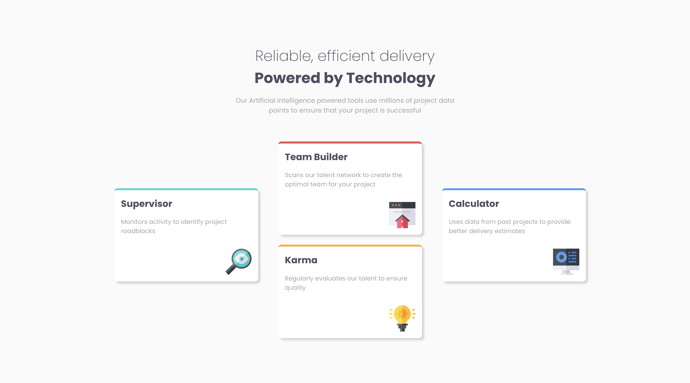

# Frontend Mentor - Four card feature section solution

This is a solution to the [Four card feature section challenge on Frontend Mentor](https://www.frontendmentor.io/challenges/four-card-feature-section-weK1eFYK).

## Table of contents

- [Overview](#overview)
  - [The challenge](#the-challenge)
  - [Screenshot](#screenshot)
  - [Links](#links)
- [My process](#my-process)
  - [What I learned](#what-i-learned)
- [Author](#author)

## Overview

### The challenge

Users should be able to:

- View the optimal layout for the site depending on their device's screen size

### Screenshot



### Links

- Live Site URL: <a href="https://frontend-mentor-four-card-73651.web.app/" target="_blank">Click Here</a>

## My process

### What I learned

I learned how to use flex to create a four card section and use translate to reposition certain elements and change order of elements.

```html
<div class="card-section">
	<section class="card supervisor change">
		<h2>Supervisor</h2>
		<p>Monitors activity to identify project roadblocks</p>
		
	</section>
	<section class="card team-builder">
		<h2>Team Builder</h2>
		<p>Scans our talent network to create the optimal team for your project</p>
		
	</section>
	<section class="card karma">
		<h2>Karma</h2>
		<p>Regularly evaluates our talent to ensure quality</p>
		
	</section>
	<section class="card calculator change">
		<h2>Calculator</h2>
		<p>Uses data from past projects to provide better delivery estimates</p>
		
	</section>
</div>
```

```css
.card-section {
	max-width: 1400px;
	display: flex;
	flex-wrap: wrap;
}

.karma {
	order: 2;
}

.calculator {
	order: 1;
}

.change {
	transform: translateY(50%);
}
```

### Useful resources

- <a href="https://css-tricks.com/snippets/css/a-guide-to-flexbox/" target="_blank">Flexbox</a> - This helped me understand and how to use flex.
- <a href="https://css-tricks.com/snippets/css/complete-guide-grid/" target="_blank">Grid</a> - This helped me understand and how to use grid.
- <a href="https://developer.mozilla.org/en-US/docs/Web/CSS/transform-function/translateY" target="_blank">CSS Translate</a> - This helped me understand and CSS translate and reposition elements.

## Author

- Linkedin - [Jaweed Inayathulla](https://www.linkedin.com/in/jaweedinayathulla/)
- Frontend Mentor - [@InaJaweed](https://www.frontendmentor.io/profile/InaJaweed)
